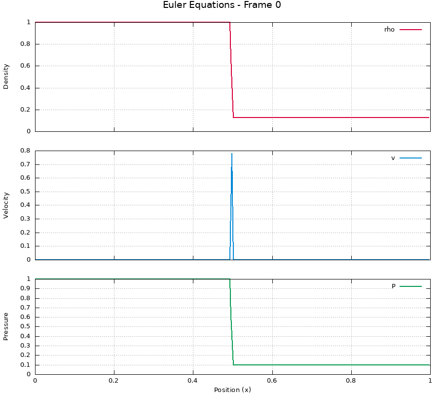

# Compressible-Fluids
Numerical Methods for Compressible Fluid Dynamics. We'll be implementing the FORCE finite volume method on the incompressible, inviscid Navier-Stokes equations, aka the Euler equations.

Visualisations of the various initial conditions considered are shown below.

### SLIC Toro 1st Initial Condition

### SLIC Toro 2nd Initial Condition

### SLIC Toro 5th Initial Condition
