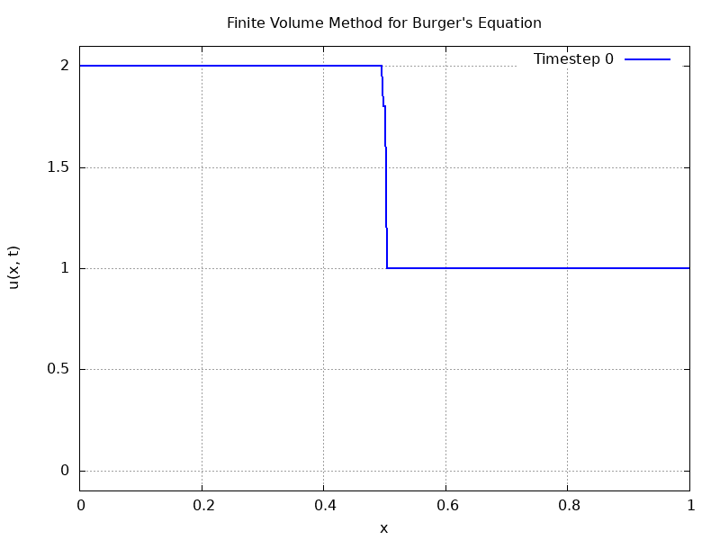

# Compressible-Fluids
Numerical Methods for Compressible Fluid Dynamics. We'll be implementing the FORCE finite volume method on the incompressible, inviscid Navier-Stokes equations, aka the Euler equations.

Visualisations of the various initial conditions considered are shown below.
### First Initial Condition

### Second Initial Condition

### Third Initial Condition

### Fourth Initial Condition
