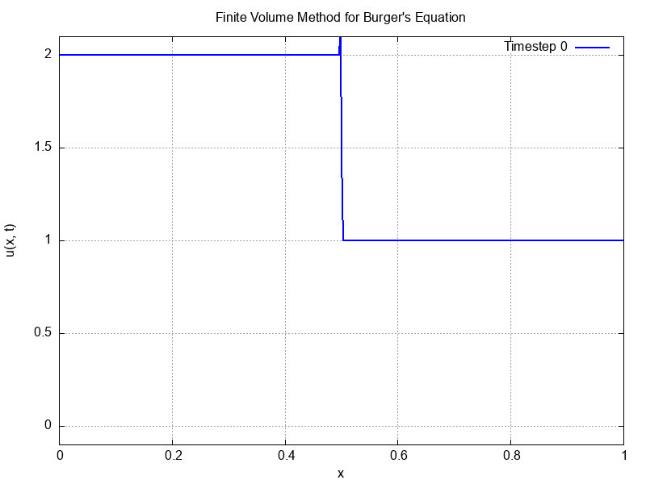
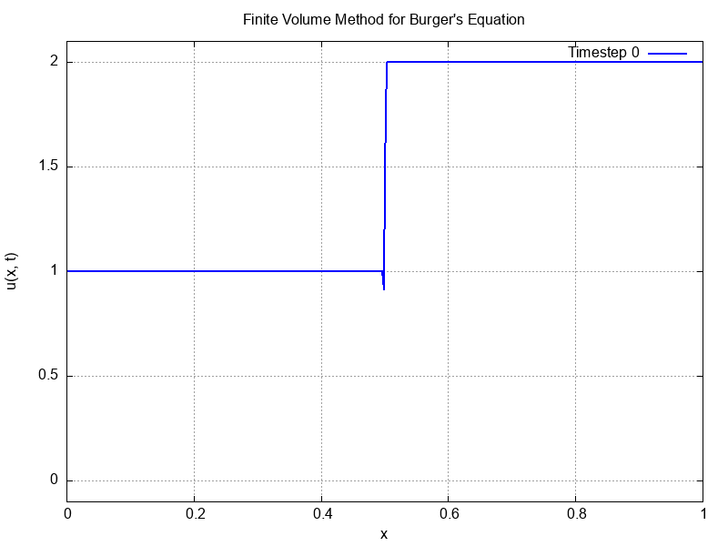
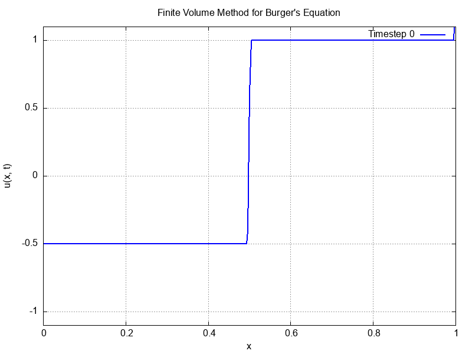
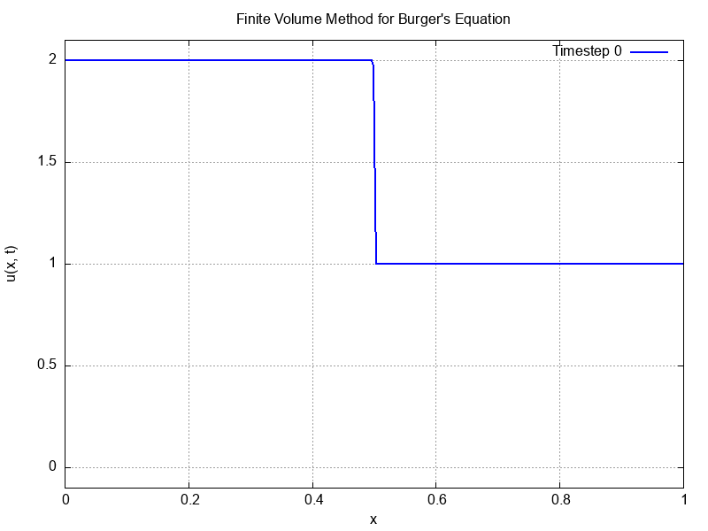
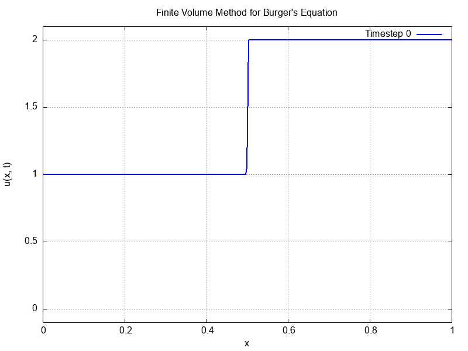
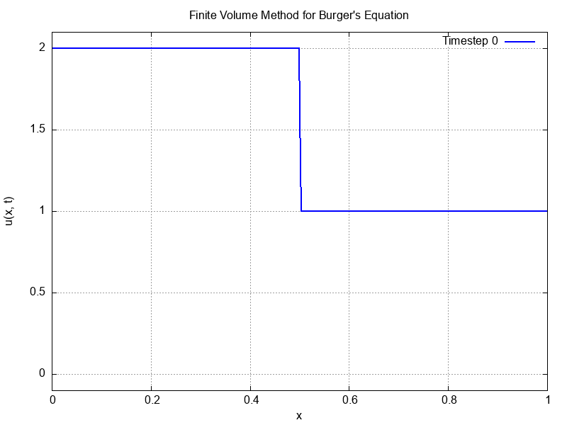

# Compressible-Fluids
Numerical Methods for Compressible Fluid Dynamics

## Finite Flux Method

Observe the visualisations below for various numerical fluxes with various initial conditions.

### Lax Friedrichs Shock Wave

### Lax Friedrichs Rarefaction Wave

### Richtmyer Shock Wave

### Richtmyer Rarefaction Wave

### Richtmyer Toro Initial Condition

### FORCE Shock Wave

### FORCE Rarefaction Wave

### Godunov Shock Wave

### Godunov Rarefaction Wave

### Godunov Toro Initial Condition
